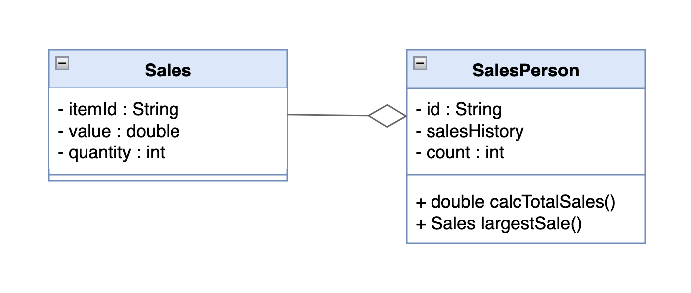
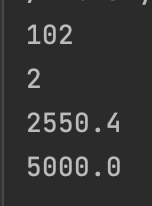

# Class Design and Implementation Case

#### Priscilla Abigail - 2602109883

A large company with locations in different cities has taken an OOP 
approach in creating an administration program that manages all aspects 
of its business. These aspects include:

* the sale of all the different products that the company manages
* the salaries for managers, office staff and sales personnel.

### Question 1 
#### (a) By making use of an example from the above scenario, distinguish between a class and an instantiation of a class. (3 points)
A class acts sort of like a template or blueprint that will be used as a 
guide to make an object whereas an instantiation of a class actually 
refers to the object made from the class itself.

#### The different modules in the program each open a graphical user interface (GUI). Each GUI has a similar design but contains differences specific to each module.

#### (b) By giving two examples, explain how the principles of inheritance can be incorporated into the design of this administration program. (4 points)
* Example 1: A base class `Employee` that consist of general properties such 
as employee ID, salary, etc., can be inherited by more specific classes 
such as `Intern` class or `Manager` class. 
* Example 2: A base class `User` that consist of general properties
like user ID, username, user email, etc., can be inherited by more
specific classes such as `Customer` class or `Administrator` class.

#### (c) Describe how the use of libraries can facilitate the development of programs like this company’s administration program. (3 points)
Libraries can greatly facilitate programs development as they offer 
pre-built functions which help developers save a significant amount of
time that in turn can be used to develop the program further. 

### Question 2
#### The company employs several sales personnel to sell its products to different retailers. Each branch of the company keeps track of its own sales with a suite of programs that include the two classes SalesPerson and Sales.

```java
public class SalesPerson {
// each object contains details of one salesperson
    private String id;
    private Sales[] salesHistory; // details of the different sales
    private int count = 0; // number of sales made

    //constructor for a new salesperson
    public SalesPerson(String id){
        // code missing
        
    }
    // constructor for a salesperson transferred (together with their sales details) from another branch
    public SalesPerson(String id, Sales[] s, int c){
        // code missing
        
    }
    public int getCount(){return count;}
    public String getId() {return id;}
    public void setSalesHistory(Sales s) {
        salesHistory[count] = s;
        count = count + 1;
    }
    public double calcTotalSales(){
        // calculates total sales for the salesperson
        // code missing
        
    }
    public Sales largestSale(){
        // calculates the sale with the largest value
        // code missing
    }
}
```

#### Each instance variable is initialized when a SalesPerson object is instantiated.

#### (a) Complete the constructor public SalesPerson(String id), from the SalesPerson class. (2 points)
```java
public SalesPerson(String id) {
        this.id = id;
        this.salesHistory = new Sales[100];
    }
```

#### (b) Explain why accessor methods are necessary for the SalesPerson class. (3 points)
Accessor methods such as setters and getters are important to ensure 
consistency and also to prevent bugs that may come up if the object were
to be accessed or modified directly by other parts of the code.

```java
public class Sales {

    // each object contains details of one sale
    
    private String itemId;     // id of the item
    
    private double value;      // the price of one item
    
    private int quantity;      // the number of the items sold
    
    // constructor missing
    
    public double getValue() {
        return value;
    }
    public int getQuantity() {
        return quantity;
    }
}
```

#### (c) (i) Construct unified modelling language (UML) diagrams to clearly show the relationship between the SalesPerson and Sales classes. (4 points)
###### Note: There is no need to include mutator or accessor methods or a constructor. 



#### (c) (ii) Outline a negative effect that a future change in the design of the Sales object might have on this suite of programs. (2 points)
Changes made to the `Sales` class would affect all classes 
that depends on that class like the `SalesPerson` class. This 
may lead to unexpected results or bugs. 

#### The company employs several sales personnel. The different salesPerson objects are held in the array salesPeople. The Driver class contains various methods that operate on the SalesPerson and Sales classes. The Driver class contains the following code:

```java
public static void main(String[] args){

        SalesPerson[]salesPeople=new SalesPerson[6];

        salesPeople[0]=new SalesPerson("100");

        salesPeople[1]=new SalesPerson("101");

        salesPeople[2]=new SalesPerson("102");

        salesPeople[0].setSalesHistory(new Sales("A100",300.00,10));

        salesPeople[0].setSalesHistory(new Sales("A200",1000.00,2));

        salesPeople[1].setSalesHistory(new Sales("A300",2550.40,10));

        System.out.println(salesPeople[2].getId());

        System.out.println(salesPeople[0].getCount());

        System.out.println(salesPeople[1].getSalesHistory(0).getValue());

        System.out.println(salesPeople[0].calcTotalSales());

        }
```

#### (d) State the output after running this code. (4 points)


#### (e) Construct the method calcTotalSales(), in the SalesPerson class that calculates the total value of the sales for a specific SalesPerson object. (5 points)
```java
public double calcTotalSales() {
        // calculates total sales for the salesperson
        double totalSales = 0;
        for (Sales sales : salesHistory){
            if (sales != null){
                totalSales += sales.getValue() * sales.getQuantity();
            }
        }
        return totalSales;
    }
```

#### The salesPeople array contains 100 instantiated objects. The company wishes to reward the salesperson whose sales have the largest total value.
#### (f) By making use of any previously written methods, construct the method highest(), that returns the ID of the salesperson whose sales have the largest total value. (5 points)
```java
public static SalesPerson Highest(SalesPerson[] salesPeople){
        SalesPerson highestSale = null;
        for(int i = 0; i < salesPeople.length; i++){
            if(salesPeople[i] != null){
                if(highestSale == null || salesPeople[i].calcTotalSales() > highestSale.calcTotalSales()){
                    highestSale = salesPeople[i];
                }
            }
        }
        return highestSale;
    }
```

#### (g) Construct the method addSales(Sales s, String id), in the Driver class, that will add a new Sales object s, to the salesperson with a specified ID. (4 points)
###### Note: You can assume that the ID is a valid one.
```java
public static void addSales(Sales s, String id) {
        //add a new Sales object s, to the salesPerson with a specified ID
        for (SalesPerson salesPerson : salesPeople) {
            if (salesPerson != null && salesPerson.getId().equals(id)) {
                salesPerson.setSalesHistory(s);
                return;
            }
        }
    }
```

#### A further class in this suite of programs is the Payroll class. This class is run at the end of each month to calculate each salesperson’s salary, which is based on the sales that have been made during that month.

#### (h) Suggest changes that must be made to the SalesPerson class and/or the Sales class to allow these calculations to be made. (3 points)
A date variable should be added along with its own setter and getter 
method which will be used to calculate the salary per month.

#### (i) Discuss the use of polymorphism that occurs in this suite of programs. (3 points)
The use of polymorphism in this suite of programs is overloading. 
This is indicated by the different parameters of the two constructors. 


